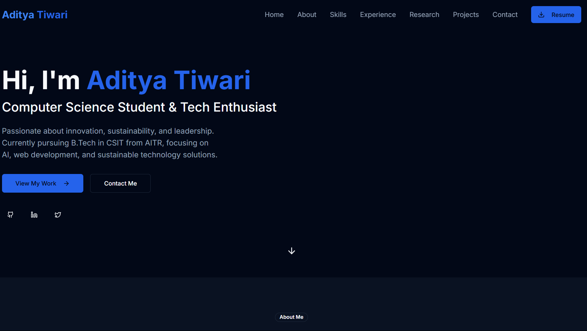

# Personal Portfolio Website

A modern, responsive portfolio website built with Next.js 15, TypeScript, and Tailwind CSS. This portfolio showcases my professional experience, projects, and skills in a clean and interactive interface.

🌐 **Live Website**: [adityatiwariportfolio.vercel.app](https://adityatiwariportfolio.vercel.app/)

## 👨‍💻 About Me

I'm Aditya Tiwari, a second-year B.Tech student in CSIT at Acropolis Institute of Technology and Research (2023-2027). Passionate about innovation, sustainability, and leadership, I focus on:

- AI and Machine Learning
- Web Development
- Sustainable Technology Solutions
- Technical Leadership

Currently serving as:
- Vice Chair at IEEE Student Branch, AITR
- Campus Ambassador at GeeksforGeeks
- International Service Director at Rotaract Club of Acropolis Royals

## 🚀 Features

- **Modern Tech Stack**: Built with Next.js 15, TypeScript, and Tailwind CSS
- **Responsive Design**: Fully responsive layout that works on all devices
- **Dark/Light Mode**: Theme switching capability using next-themes
- **Component Library**: Utilizes shadcn/ui components for a consistent and beautiful UI
- **Animations**: Smooth animations and transitions using Framer Motion
- **Type-Safe**: Full TypeScript support for better development experience

## 💼 Key Sections

- **About**: Comprehensive background and professional journey
- **Skills**: Technical expertise in various domains
- **Experience**: Professional roles and responsibilities
- **Research**: Published academic works and findings
- **Projects**: Showcase of technical projects
- **Contact**: Professional contact information

## 🛠️ Tech Stack

- **Framework**: Next.js 15
- **Language**: TypeScript
- **Styling**: Tailwind CSS
- **UI Components**: shadcn/ui
- **Animations**: Framer Motion
- **Package Manager**: pnpm
- **Form Handling**: React Hook Form
- **Data Validation**: Zod
- **Icons**: Lucide React
- **Date Handling**: date-fns

## 📦 Installation

1. Clone the repository:
   ```bash
   git clone https://github.com/adityatiwari12/MyPortfolio.git
   ```

2. Navigate to the project directory:
   ```bash
   cd MyPortfolio
   ```

3. Install dependencies:
   ```bash
   pnpm install
   ```

4. Run the development server:
   ```bash
   pnpm dev
   ```

5. Open [http://localhost:3000](http://localhost:3000) in your browser to see the result.

## 🏗️ Project Structure

```
├── app/                  # Next.js app directory
├── components/          # React components
│   ├── ui/             # UI components
│   └── ...            # Feature components
├── hooks/              # Custom React hooks
├── lib/                # Utility functions
├── public/             # Static assets
└── styles/             # Global styles
```

## 🎨 Components

The project includes several key components:

- **Hero**: Landing section with introduction
- **About**: Detailed information about me
- **Experience**: Work history and professional experience
- **Projects**: Showcase of personal and professional projects including:
  - Anveshan AI: AI-powered Lost & Found Human Identification System
  - Medicine Recommendation System: Smart Healthcare Tool with NLP and ML
- **Contact**: Contact form and information
- **Tech Stack**: Technologies and skills
- **Research**: Published research works including:
  - Integrating Renewable Energy into ASIC-based Crypto Mining
  - K-dimensional Trees for Efficient Face Detection

## 🔧 Development

- Run development server:
  ```bash
  pnpm dev
  ```

- Build for production:
  ```bash
  pnpm build
  ```

- Start production server:
  ```bash
  pnpm start
  ```

## 🚀 Deployment

This project is deployed on Vercel. You can visit the live site at [adityatiwariportfolio.vercel.app](https://adityatiwariportfolio.vercel.app/)

The project can also be deployed on other platforms that support Next.js applications, such as:
- Netlify
- AWS Amplify
- Digital Ocean

## 📫 Contact

- **Email**: adityatiwari8@ieee.org
- **Phone**: +91 7648935563
- **Location**: Indore, India

## 📝 License

This project is open source and available under the MIT License.

## 👤 Author

**Aditya Tiwari**
- GitHub: [@adityatiwari12](https://github.com/adityatiwari12)
- Portfolio: [adityatiwariportfolio.vercel.app](https://adityatiwariportfolio.vercel.app/)

## 🤝 Contributing

Contributions, issues, and feature requests are welcome! Feel free to check the issues page or contact me directly. 
